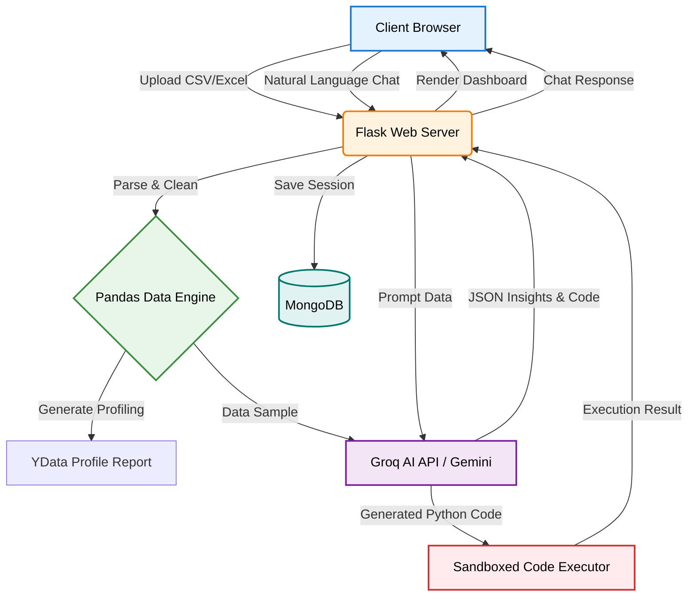

<div align="center">
  
# 📊 DataLens AI (V2)

### *Intelligent Full-Stack Data Analytics Agent*

<p align="center">
  
  
  
  
  
</p>

**An autonomous AI-powered web platform that transforms raw datasets into professional, interactive dashboards and actionable insights in under 30 seconds.**

<p align="center">
  <a href="https://datalens-v2-tu98.onrender.com/">🚀 Live Web App Demo</a> •
  <a href="https://huggingface.co/spaces/adinathjagtap/ai-data-analysis-agent">🚀 V1 Notebook Demo</a> •
  <a href="https://youtu.be/lJAdrE78hZ8">📺 Video Demo</a>
</p>


</div>

## 📖 Table of Contents

- [🎯 Problem & Solution](#-problem--solution)
- [🏗️ System Architecture](#️-system-architecture)
- [✨ Core Capabilities](#-core-capabilities)
- [🚀 Quick Start (Local Setup)](#-quick-start-local-setup)
- [🎨 Interactive Features](#-interactive-features)
- [🔧 Technical Stack](#-technical-stack)
- [📊 Use Cases](#-use-cases)
- [🛡️ Security & Privacy](#️-security--privacy)

<br>

## 🎯 Problem & Solution

### The Challenge
Modern data analysis faces critical barriers:
- **Complexity**: Multiple tools required for cleaning, analysis, and visualization.
- **Technical Skills**: Demands expertise in Python, pandas, and visualization libraries.
- **Time Investment**: Manual processes consume hours of productive time.
- **Accessibility**: Non-technical users are often locked out of advanced analytics.

### Our Solution (V2 Update)
DataLens AI V2 completely reimagines the workflow, moving beyond Jupyter Notebooks and delivering a **production-ready, interactive web application**. 

```
Raw Data → AI Processing → Professional Insights
   ↓            ↓                    ↓
Upload → Groq LLM Analysis → Interactive Plotly Dashboard
```

**Key Benefits:**
- 🤖 **AI-Driven**: Leverages Groq (Llama-3.3-70b) for blazing fast, intelligent data parsing.
- ⚡ **Instant Execution**: From CSV upload to a full interactive dashboard in seconds.
- 🚀 **Zero-Code Interface**: Purely graphical and conversational interface.
- 📊 **Dynamic Dashboards**: Fluid, cross-filtering Plotly charts with a premium UI.


## 🏗️ System Architecture

DataLens AI V2 operates on a highly responsive, multi-tier architecture designed for speed and reliability.




## ✨ Core Capabilities

<table>
<tr>
<td width="33%" align="center">
<h3>📊 Interactive Dashboards</h3>
<p>8 dynamically generated Plotly.js charts that adapt to your specific dataset columns automatically. Hover, zoom, and pan directly in the browser.</p>
</td>
<td width="33%" align="center">
<h3>💬 Chat with your Data</h3>
<p>Ask plain English questions. The AI generates and executes Pandas code in the background to answer you instantly.</p>
</td>
<td width="33%" align="center">
<h3>🔗 Secure Sharing</h3>
<p>Generate password-protected, read-only links to share your interactive dashboards and insights with stakeholders.</p>
</td>
</tr>
<tr>
<td width="33%" align="center">
<h3>📈 YData Profiling</h3>
<p>Generate deep, extensive statistical profiles covering missing values, correlations, and distribution curves.</p>
</td>
<td width="33%" align="center">
<h3>🤖 AI Quality Scoring</h3>
<p>Automatic dataset scoring (0-100) with detailed anomaly detection, skewness warnings, and cleaning recommendations.</p>
</td>
<td width="33%" align="center">
<h3>📁 Multi-Format Export</h3>
<p>Export your cleaned data and results to CSV, JSON, Excel, Parquet, or download a beautifully formatted PDF report.</p>
</td>
</tr>
</table>


## 🎨 Interactive Features

Click the dropdowns below to explore how DataLens AI automates the data analysis lifecycle:

<details>
<summary><b>1️⃣ Smart Data Upload & Parsing</b></summary>
<br>
Drop any CSV or Excel file up to 50MB. The system automatically detects delimiters, encodings, and data types. It seamlessly handles missing values and prepares the data for AI ingestion without any manual prep work.
</details>

<details>
<summary><b>2️⃣ Automated Visualization Engine</b></summary>
<br>
Instead of manually building charts, the system auto-detects column roles (e.g., identifying "Revenue" as sales and "Date" as time). It instantly renders:
<ul>
  <li><b>Sales over Time:</b> Line charts tracking performance.</li>
  <li><b>Categorical Breakdown:</b> Bar charts and Pie charts for regional or product data.</li>
  <li><b>Correlations:</b> Scatter plots mapping quantitative relationships.</li>
  <li><b>Top N Rankings:</b> Animated ranking visuals.</li>
</ul>
</details>

<details>
<summary><b>3️⃣ Chat & Code Execution</b></summary>
<br>
Type a question like <i>"What was the highest grossing product in Q3?"</i>. The Groq LLM translates this into Python/Pandas code, safely executes it against your dataset, and returns the exact numerical answer or a formatted table.
</details>

<details>
<summary><b>4️⃣ Data Quality & Profiling</b></summary>
<br>
A dedicated profiling engine runs YData-Profiling to generate a standalone HTML report. It highlights high cardinality, severe skewness, exact missing row counts, and Spearman/Pearson correlation matrices.
</details>


## 🚀 Quick Start (Local Setup)

Want to run DataLens V2 on your own machine? Follow these steps:

### Prerequisites
| Requirement | Version | Status |
|:------------|:-------:|:------:|
| **Python** | 3.10+ | ✅ Required |
| **MongoDB** | Local or Atlas | ✅ Required |
| **Groq API Key** | - | 🔑 Required |

### Installation Steps

**1. Clone the Repository**
```bash
git clone https://github.com/Adinath-Jagtap/DataLens-AI-Intelligent-Data-Analytics-Agent.git
cd DataLens-AI-Intelligent-Data-Analytics-Agent
```

**2. Set up a Virtual Environment**
```bash
python -m venv venv
source venv/bin/activate  # On Windows: .\venv\Scripts\activate
```

**3. Install Dependencies**
```bash
pip install -r requirements.txt
```

**4. Configure Environment Variables**
Create a `.env` file in the root directory:
```env
FLASK_SECRET_KEY=your_secure_secret_key_here
MONGO_URI=mongodb://localhost:27017/
GROQ_API_KEY=your_groq_api_key_here
# Optional: GEMINI_API_KEY=your_gemini_key
```

**5. Run the Server**
```bash
python run.py
```
*Open your browser and navigate to `http://127.0.0.1:5000`*


## 🔧 Technical Stack

### Core Dependencies

<table>
<tr>
<td width="50%" valign="top">

#### 🌐 Backend & Server
```python
Flask       # Web framework
PyMongo     # Database driver
Bcrypt      # Password hashing
Flask-Login # Auth management
```

#### 📊 Data Processing
```python
pandas      # Data manipulation
numpy       # Numerical operations
ydata-profiling # Statistical reports
```

</td>
<td width="50%" valign="top">

#### 🧠 AI Integration
```python
groq        # Llama-3.3 LLM Inference
google-generativeai # Gemini API fallback
```

#### 📈 Frontend & Visuals
```html
Plotly.js   # Interactive charts
Vanilla CSS # Responsive custom styling
Jinja2      # Server-side rendering
```

</td>
</tr>
</table>


## 📊 Use Cases

<table>
<tr>
<td width="50%" valign="top">

### 💼 Business Intelligence
- Sales analysis & revenue forecasting
- Performance tracking & KPI monitoring
- Market trend identification
- Quick ad-hoc reporting for executives

### 🔬 Data Science
- Automated Exploratory Data Analysis (EDA)
- Feature engineering preparation
- Instant data quality assessment
- Missing value analysis

</td>
<td width="50%" valign="top">

### 📊 Research Analytics
- Rapid statistical profiling
- Correlation and skewness studies
- Pattern recognition across variables
- Dataset sanitization

### 📋 Operations & HR
- Employee survey result analysis
- Inventory tracking & anomalies
- Marketing campaign metrics
- Customer segmentation insights

</td>
</tr>
</table>


## 🛡️ Security & Privacy

```
╔═══════════════════════════════════════════════════════════╗
║               SECURITY & PRIVACY MEASURES                 ║
╠═══════════════════════════════════════════════════════════╣
║  ✅  Ephemeral Data Processing                            ║
║      → Uploaded datasets are parsed in memory and do not  ║
║        persist on the disk.                               ║
║                                                           ║
║  ✅  Password Protected Sharing                           ║
║      → Public dashboard links can be locked with custom   ║
║        passwords to prevent unauthorized access.          ║
║                                                           ║
║  ✅  Secure Authentication                                ║
║      → All user credentials are hashed using standard     ║
║        bcrypt algorithms.                                 ║
╚═══════════════════════════════════════════════════════════╝
```


<div align="center">

## 🎓 Capstone Project

**Google's 5-Day AI Agents Intensive Course**

<br>

<p>
  <a href="https://youtu.be/lJAdrE78hZ8">
    
  </a>
  <a href="https://datalens-v2-tu98.onrender.com/">
    
  </a>
</p>

### Built Using

<p>
  
  
</p>

<br>

**Transform your data into insights with AI ✨**

<br>

Made by **Adinath Somnath Jagtap** & **Prajwal Ashok Zolage** 

<br>


</div>
